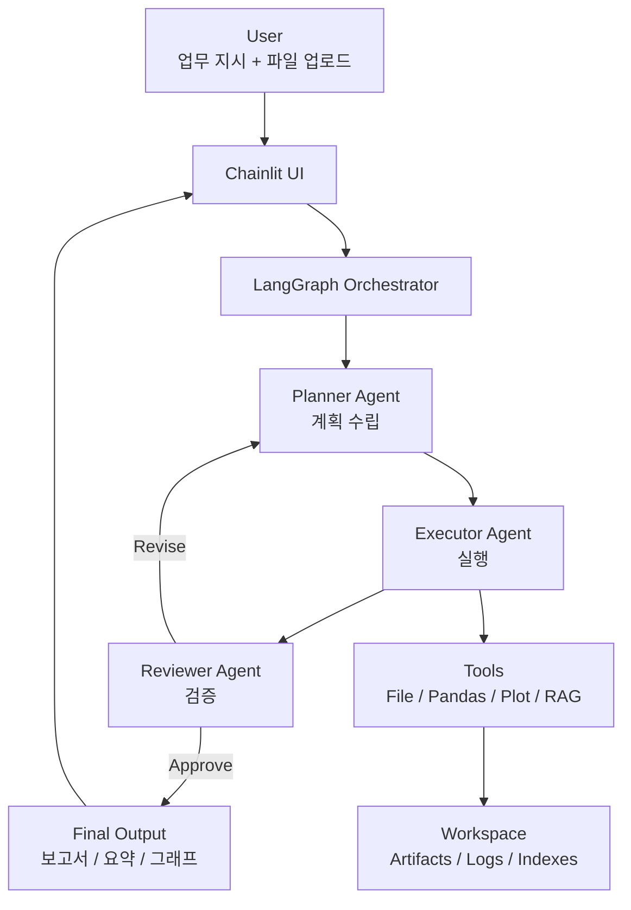

# DIA (Decision & Insight Automation Agent)

## 1. 프로젝트 주제

**DIA (Decision & Insight Automation Agent)** 는
자연어로 주어진 업무 지시를 이해하고, 스스로 **계획 → 실행 → 검증** 과정을 거쳐
최종 결과물(분석 결과, 시각화, 보고서 등)을 완성하는 **Multi-Agent 기반 AI 시스템**입니다.

### 핵심 목표

- 단순 질의응답(Chatbot)이 아닌 **업무 수행 주체로서의 AI Agent**
- 해커톤 환경에서 **빠른 조립, 안정적인 실행, 명확한 Agent성 시연**
- 이후 다양한 AI Agent를 **플러그인 형태로 확장 가능**

### 한 줄 요약

> “자연어로 업무를 지시하면, AI Agent가 스스로 판단·실행·검증하여 결과물을 완성한다.”

---

## 2. 아키텍처 다이어그램

### 전체 Multi-Agent 흐름



### Agent 역할 정의

- **Planner Agent**: 사용자 요청 해석, 작업 분해 및 실행 계획 수립
- **Executor Agent**: 계획에 따라 실제 도구 실행(분석, 시각화, 문서 생성)
- **Reviewer Agent**: 결과 검증 및 수정 요청 또는 승인

---

## 3. 기술 스택

### 핵심 기술 선택 기준

- 해커톤 당일 **설치/실행 안정성**
- Agent 사고 과정 **시각화 가능**
- 모듈화 및 확장성

### 기술 스택 구성

#### Runtime

- **Python 3.11.x (권장)**

#### UI

- **Chainlit**

  - 대화형 UI
  - Agent Step / Trace 시각화
  - 비동기 스트리밍 지원

#### Agent Orchestration

- **LangGraph**

  - Planner–Executor–Reviewer 루프 구성
  - 조건 분기 및 반복 제어

#### LLM Interface

- **LangChain**
- **OpenRouter** (모델 제공)

#### Data / Tools

- **Pandas**: 데이터 분석
- **Matplotlib**: 시각화
- **pdfplumber**: PDF 텍스트 추출
- **FAISS (Local)**: RAG 인덱싱 (옵션)

#### Config / State

- **pydantic / pydantic-settings**
- **python-dotenv**

---

## 4. 프로젝트 구조

본 프로젝트는 **UI / Core Platform / Agent Plugin** 3레이어 구조를 따릅니다.

```
dia-agent-platform/
├─ apps/                     # UI 레이어
│  └─ chainlit_app/
│     ├─ app.py              # Chainlit entrypoint
│     └─ ui/                 # UI 공통 컴포넌트
│
├─ core/                     # 플랫폼 공통 영역 (재사용)
│  ├─ agent/                 # Agent 실행/등록/런타임
│  ├─ graph/                 # GraphState / 이벤트 정의
│  ├─ llm/                   # LLM 클라이언트 및 모델 정책
│  ├─ tools/                 # 공통 도구(File, 분석, 시각화 등)
│  ├─ artifacts/             # 산출물 저장 및 메타 관리
│  ├─ config/                # 설정 및 로깅
│  └─ utils/                 # 공통 유틸
│
├─ agents/                   # Agent 플러그인 영역
│  └─ dia/                   # DIA Agent
│     ├─ agent.py            # BaseAgent 구현
│     ├─ graph.py            # LangGraph 구성
│     ├─ prompts/            # Planner / Executor / Reviewer 프롬프트
│     └─ README.md
│
├─ workspace/                # 런타임 생성 파일 (git 제외)
│  ├─ uploads/
│  ├─ artifacts/
│  ├─ indexes/
│  ├─ traces/
│  └─ logs/
│
├─ requirements.txt
├─ requirements.lock.txt     # 해커톤/재현 환경 고정
├─ .env.example
└─ README.md
```

### 구조 설계 의도

- **Agent 추가**: `agents/<agent_id>/` 디렉토리만 추가
- **UI 교체**: `apps/` 레이어만 수정
- **도구 재사용**: `core/tools/` 중심

---

## 정리

DIA는 해커톤용 단기 프로젝트이면서 동시에
**확장 가능한 AI Agent 플랫폼의 최소 구현(MVP)**을 목표로 합니다.

> “Agent를 쉽게 붙였다 떼었다 할 수 있는 구조” <br/>
> “사고 과정이 보이는 AI” <br/>
> “당일 절대 터지지 않는 환경” <br/>

을 핵심 가치로 설계되었습니다.

---

## 5. 개발 환경 및 실행 준비

본 프로젝트는 해커톤 당일 환경 이슈를 최소화하기 위해
**Python 버전 고정 + 의존성 Lock 파일** 기반으로 환경을 구성합니다.

### 5.1 Python 버전

- **Python 3.11.x (권장: 3.11.9)**
- Python 3.12 / 3.13은 일부 라이브러리 호환성 이슈 가능성으로 사용하지 않습니다.

여러 Python 버전이 설치된 환경에서는
**Python Launcher(`py`)를 사용하여 3.11을 명시적으로 지정**합니다.

```powershell
py -3.11 --version
```

---

### 5.2 가상환경 생성 및 활성화

프로젝트 루트에서 아래 명령을 실행합니다.

```powershell
py -3.11 -m venv .venv
.\.venv\Scripts\activate
```

활성화 후 반드시 Python 버전을 확인합니다.

```powershell
python --version
# Python 3.11.x 출력 확인
```

---

### 5.3 의존성 설치 (Lock 파일 기준)

본 프로젝트는 **`requirements.lock.txt`를 기준으로 의존성을 고정**합니다.

```powershell
python -m pip install --upgrade pip setuptools wheel
pip install -r requirements.lock.txt
```

설치 후 의존성 충돌 여부를 반드시 확인합니다.

```powershell
pip check
```

출력이 없으면 정상입니다.

---

### 5.4 환경 재현성 검증 (권장)

해커톤 당일 환경 문제를 방지하기 위해
**가상환경 삭제 후 재설치 테스트를 완료한 상태**입니다.

```powershell
deactivate
Remove-Item -Recurse -Force .venv -ErrorAction SilentlyContinue

py -3.11 -m venv .venv
.\.venv\Scripts\activate
pip install -r requirements.lock.txt
pip check
```

이 과정을 통과하면,
동일한 개발 환경을 언제든지 재현할 수 있습니다.

---

### 5.5 정리

- Python 버전: **3.11.x 고정**
- 의존성 관리: **requirements.lock.txt 사용**
- 설치 검증: **pip check 통과**

> 본 프로젝트는 환경 문제로 인한 실행 실패 가능성을 최소화하도록 설계되었습니다.

---
